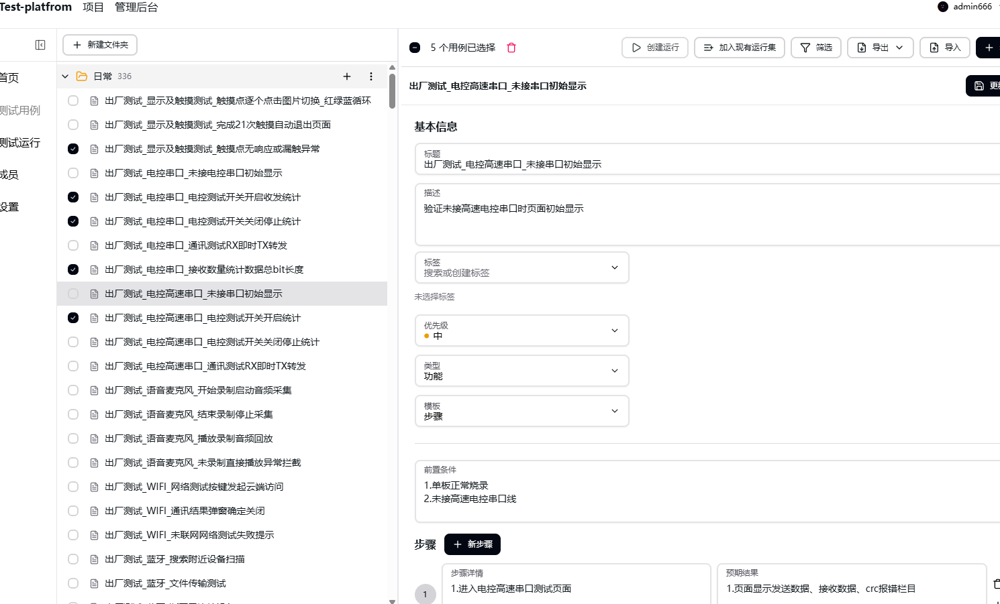

<p align="center">
  
</p>

<h1 align="center">Test-platfrom</h1>

<p align="center">测试用例管理与测试执行平台</p>

Test-platfrom 支持按项目管理测试用例、组织测试运行、记录执行结果和导出测试报告，适合团队自托管使用。

## 主要功能

- 按项目和文件夹组织用例，通过树形目录查看用例详情。
- 导入 Excel 测试用例，同名用例更新，步骤与预期结果按序号对应。
- 从用例库创建测试运行，或加入已有运行集。
- 分配负责人、记录状态和评论，查看测试进度。
- 按文件夹导出多 Sheet 的 Excel 系统测试报告。
- 管理账号、项目成员和角色权限，维护项目专属用例类型。
- 支持中文界面、PostgreSQL 数据库和可选的 OIDC 单点登录。

## 界面预览

### 用例详情

左侧按文件夹查看测试用例，右侧展示前置条件、操作步骤、预期结果与附件。


### 批量选择用例

勾选多个测试用例后，可以创建运行或加入已有运行集。



### 测试运行

查看运行进度、管理运行状态，并按文件夹浏览本次运行中的测试用例。


## 快速开始

```bash
git clone https://github.com/moliason/Test-platfrom.git
cd Test-platfrom
docker compose up --build
```

启动后访问 [本地页面](http://localhost:8000/zh-CN/account/signin)。

首次使用可通过 Compose 的 `ADMIN_USERNAME`、`ADMIN_EMAIL`、`ADMIN_PASSWORD` 配置管理员。对外部署前请修改默认密码、数据库密码和 `SECRET_KEY`；不要把实际凭据提交到仓库。

- [本地源码启动](./docs/docs/getstarted/from-source.md)
- [环境变量配置](./docs/docs/getstarted/environment.md)
- [OIDC 配置](./docs/docs/getstarted/oidc.md)
- [提交问题](https://github.com/moliason/Test-platfrom/issues)
- [参与贡献](./CONTRIBUTING.md)

## 许可证与来源

项目基于 [UnitTCMS](https://github.com/kimatata/unittcms) 开发，保留上游版权声明：Copyright © 2024-present UnitTCMS。

代码遵循 [GPL-3.0](./LICENSE) 许可证。Test-platfrom 为本项目的展示名称，不改变上游代码的许可和归属。
